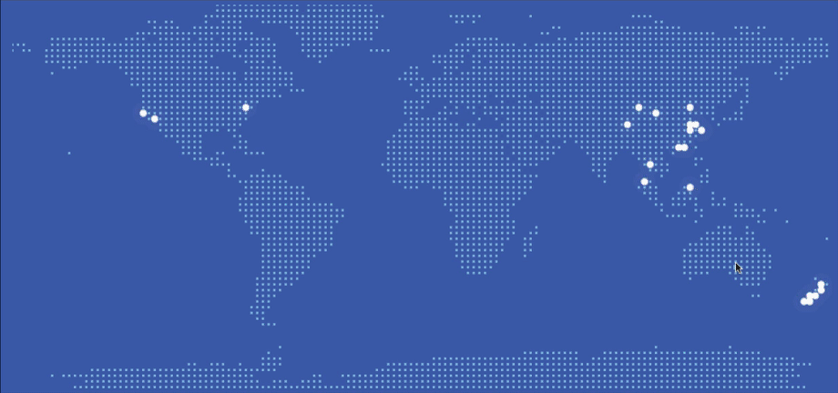

# Point-map

绘制优美的点阵地图。

[在线Demo](https://zmofei.github.io/point-map/dist/)



[相关介绍](https://www.zhuwenlong.com/blog/article/5d68d93223d760b4bf736014)

## 用法

### 1. 安装

Point-map 可以通过`NPM`安装或者通过`<Script>` 标签直接引用

#### 1.1 方案一：通过NPM安装

通过如下命令安装组件

```bash
npm install point-map
```

通过import导入NPM install的组件

```javascript
import PointMap from 'point-map'
```

#### 1.2 通过Script标签使用

```html
<script src="https://unpkg.com/point-map/dist/mymap.min.js" crossorigin></script>
```


## 示例

```html
<html>
  <head>
    <title>Point-map demo</title>
    <script src="https://unpkg.com/point-map/dist/pointmap.min.js" crossorigin></script>
  </head>
  <body>
    <div id="map"></div>
    <script type="text/javascript">
      // Create an instance
      let map = new PointMap('map');
      // Add event points 
      map.addEvents([{
        name: '上海',
        coordinate: [121.47, 31.233]
      }, {
        name: '北京',
        coordinate: [116.41, 39.90]
      }]);
      // regiest events
      map.on('mousemove', function(e, data) {
        console.log(data);
      })
    </script>
  </body>
</html>
```

## 接口说明

### PointMap(elementID)

创建一个地图实例，其中`elementID`为放置地图的Dom的id。

示例:

```javascript
new PointMap('map');
```

### PointMap.addEvent(EventObject)

添加地图点

`EventObject.name` [String] 点名字，可自定义。
`EventObject.coordinate` [Array]  点的经纬度 [纬度, 经度]
`EventObject[others]` [Any] 自定义的其他数据;

示例:

```javascript
map.addEvents({
  name: 'Shanghia',
  coordinate: [121.47, 31.233]
})
```


### PointMap.addEvents([EventPoints])

批量添加点，`PointMap.addEvent`的批量添加方式。

示例:

```javascript
map.addEvents([
  {
    name: 'Shanghia',
    coordinate: [121.47, 31.233]
  },
  {
    name: 'Beijing',
    coordinate: [116.41, 39.90]
  }
])
```

### PointMap.on(EventName, CallbackFunction)

添加点事件。

`EventName` [String] 事件名称，可为 `mousemove`,`click`

`CallbackFunction(event, Pointinfo)` 当事件被触发时该回调会被调用，第一个参数位Dom的event对象，第二个参数为点的属性。

示例：

```
let map = new PointMap('map');
// Add event points 
map.addEvents({
  name: '上海',
  coordinate: [121.47, 31.233]
});

map.on('mousemove', function(e, data) {
    if (data) {
        console.log('you are move into a customer Event', data)
    } else {
        console.log('you are not on a custome')
    }
});
```


### PointMap.remove(EventName, EventFunction)

移除事件。

`EventName` [String] 事件名称

`EventFunction` 移除的事件方法

Examples:

```
let map = new PointMap('map');
// Add event points 
map.addEvents({
  name: '上海',
  coordinate: [121.47, 31.233]
});

const fn = (e,data)=>{console.log('you are moving')};

map.on('mousemove', fn);
map.remove('mousemove', fn);
```
